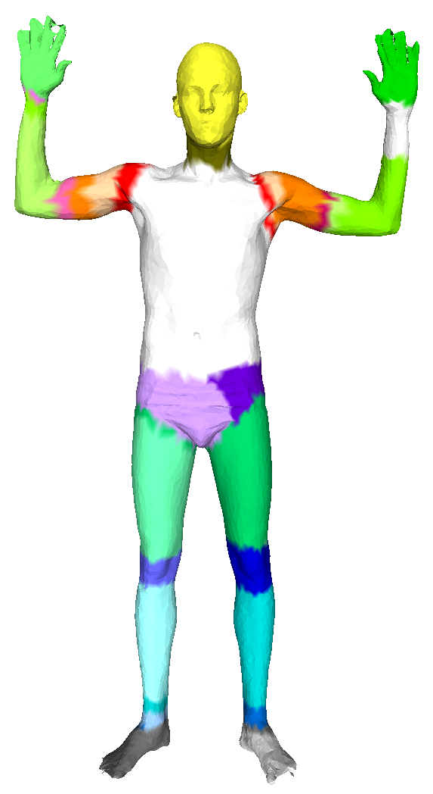

# Human Part Segmentation with Point Transformer
This repo provides the model training and post processing algorithm of human point cloud data for body part segmentation. Each human point cloud have 10000 verts with .ply file and .txt annotation file.

## Getting Started
Use the pip to install dependencies, you may use conda instead

```bash
pip install torch_geometric
pip install torch torchvision torchaudio
pip install numpy
pip install pandas
```

## Point cLoud data structure
This repo is using [Semantic Segmentation Editor](https://github.com/Hitachi-Automotive-And-Industry-Lab/semantic-segmentation-editor.git) as labeling tool. It support .pcd file as input and output .txt file as annotation.  
Please refer to [Human Point Cloud Annotation Tool](https://github.com/issacchan26/point-cloud-annotation) for annotation details.  

The annotation .txt file structure is shown below:  

```
VERSION .7
FIELDS x y z label object
SIZE 4 4 4 4 4
TYPE F F F I I
COUNT 1 1 1 1 1
WIDTH 10000
HEIGHT 1
POINTS 10000
VIEWPOINT 0 0 0 1 0 0 0
DATA ascii
-0.1107769981 -0.7707769871 0.3798840046 13 -1
-0.1013249978 -0.7747700214 0.3794080019 13 -1
-0.1050020009 -0.7672169805 0.3793739974 13 -1
```

Each row of point is representing:  
```
x y z label type
```

## Folder structure
Please make sure that you place the files and folders as shown below.  
1. Place the train data .txt in /train_data/raw  
2. Place the validation data .txt in /eval_data/raw  
For train and validation data, the processed folder will be generated after running train.py  

3. Place the test data .ply in /test_data/raw, and place the .ply files in /ply_data/input as well  
The output .ply with annotated color will be generated in /test_data/output  

```
├── eval_data
│   ├── raw
│   │  ├── sample_scan1.txt
├── ply_data
│   ├── input
│   │  ├── sample_scan2.ply
│   ├── output
├── test_data
│   ├── raw
│   │  ├── sample_scan2.ply (without label) or sample_scan2.txt (with label)
│   ├── output
├── train_data
│   ├── raw
│   │  ├── sample_scan3.txt
├── checkpoints
├── dataset.py
├── model.py
├── test.py
└── train.py

```

## Test file structure
The [test.py](test.py) will create .ply with annotated color. 
The testing .ply files should contain header in first 10 rows, xyz coordinates and face. File structure is shown as below:

```
ply
format ascii 1.0
comment VCGLIB generated
element vertex 10000
property double x
property double y
property double z
element face 19970
property list uchar int vertex_indices
end_header
-0.06270100000000001 0.969969 -0.352219 
-0.067915 0.968893 -0.36525 
-0.07369000000000001 0.975634 -0.371222 
.
.
.
3 69 25 32 
3 1844 92 43 
3 37 977 21 
3 14 35 4 
```

## Model training
This repo is using Point Transformer with PYG framework as backbone. The model architecture is stored in [model.py](model.py)  
We are using the point cloud data with 10000 verts for training. For each point cloud, we use .txt annotation file for training and .ply file for testing/validation. Please make sure that you prepare both .ply file and .txt annotation file before training and testing.  
Before you start training, please modify below path/parameters in [train.py](train.py):  

train_dataset_path = '/path to/train_data'  
eval_dataset_path = '/path to/eval_data'  
checkpoints_path = '/path to/checkpoints/'  
log_dir = '/path to/runs'  
body_parts = 6  
batch_size = 1  
lr = 0.0001  
epoch = 500  

## Number of body part
The dafault option of body parts is 28, the labels are listed as below:  
    0,   # rest of body  
    1,   # head  
    2,   # neck  
    3,   # right_shoulder  
    4,   # left_shoulder  
    5,   # right_upper_arm  
    6,   # left_upper_arm  
    7,   # right_elbow  
    8,   # left_elbow  
    9,   # right_fore_arm  
    10,  # left_fore_arm  
    11,  # right_wrist  
    12,  # left_wrist  
    13,  # right_hand  
    14,  # left_hand  
    15,  # main_body  
    16,  # right_hip  
    17,  # left_hip  
    18,  # right_thigh  
    19,  # left_thigh  
    20,  # right_knee  
    21,  # left_knee  
    22,  # right_leg  
    23,  # left_leg  
    24,  # right_ankle  
    25,  # left_ankle  
    26,  # right_foot  
    27   # left_foot  

There are four options for number of body parts:  
    4: {0: main body, 1: head, 2: arm, 3: leg}  
    6: {0: main body, 1: head, 2: right arm, 3: left arm, 4: right leg, 5: left leg}  
    14: {0 to 13}, body parts are same as 28, but without left/right direction  
    28: default  

## Training Logs
This repo is using Tensorboard to save the logs, please run tensorboard --logdir /runs in the terminal to view the plots.

## Inference
Before you start inference, please modify below path/parameters in [test.py](test.py):  

test_dataset_path = '/path to/eval_data'  
model_path = '/path to/checkpoints/best.pt'  
ply_path = '/path to/test_data/input/'  
output_ply_path = '/path to/test_data/output/'  
body_part = 28  
acc_threshold = 0.76  # The model will keep replace the output .ply until it reached target accuracy threshold  
with_label = False  # The default setting is False, please change to True for validation  

## Validation
The parameter with_label in [test.py](test.py) determines whether current stage is test or validation, False for test while True for validation.  
When you would like to perform validation, please follow the below steps:  
1. Place the .txt annotation in /test_data/raw  
2. Place the corresponding .ply files in /ply_data/input  
3. Make sure the parameter with_label is True in [test.py](test.py) and run the script  

## Pretrained models
This repo also provides pretrained models for 4, 6 and 28 classes in [checkpoints](checkpoints).  
These models are trained with 41 human scans from real human data and FAUST, each of them has 10000 verts.  
The below table shows the results of 200 epochs training:  
| Class  | Training Accuracy | Validation Accuracy  |
| -------| ----------------- | -------------------- | 
|  4     | 0.965             | 0.953                |
|  6     | 0.97              | 0.963                |
|  14    | 0.902             | 0.869                |
|  28    | 0.866             | 0.808                |

And the testing results:  

<p float="left">
  
   
  
</p>

## Common Issues
Q: The model output classes is not as expected, e.g. Expect 28 classes results but only got 4 classes results.  
A: Please delete the processed folder in train_data, eval_data and test_data when changes the number of classes.  

Q: There is bug when reading .ply files, the extracted rows did not match original files.  
A: Please check the number of verts in .ply files and the rows of header, the default setting will skip the header and read 10000 rows for xyz coordinates. Please modify the code if needed: rows 144,155 in [dataset.py](dataset.py) and rows 86, 103, 125 in [test.py](test.py).  

Q: I have .obj mesh files only, how to transform into .ply or .pcd format?  
A: Please refer to [Mesh Processing Tools](https://github.com/issacchan26/mesh-processing), it provides algoritms to transform .obj files into other formats, as well as data augmentation with mesh simplification, mesh rigid transform.  
